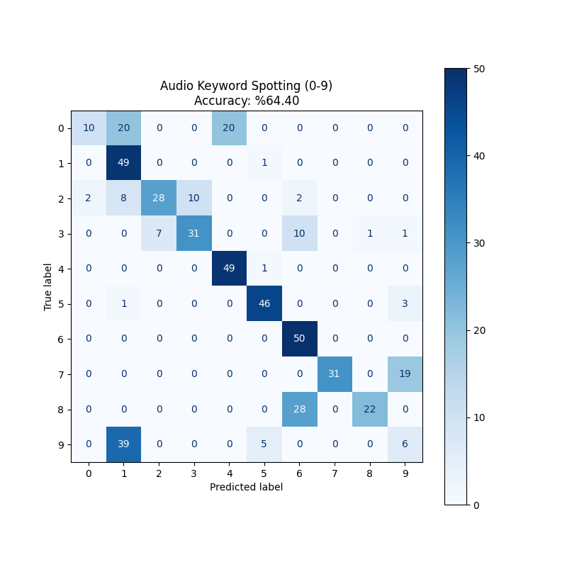
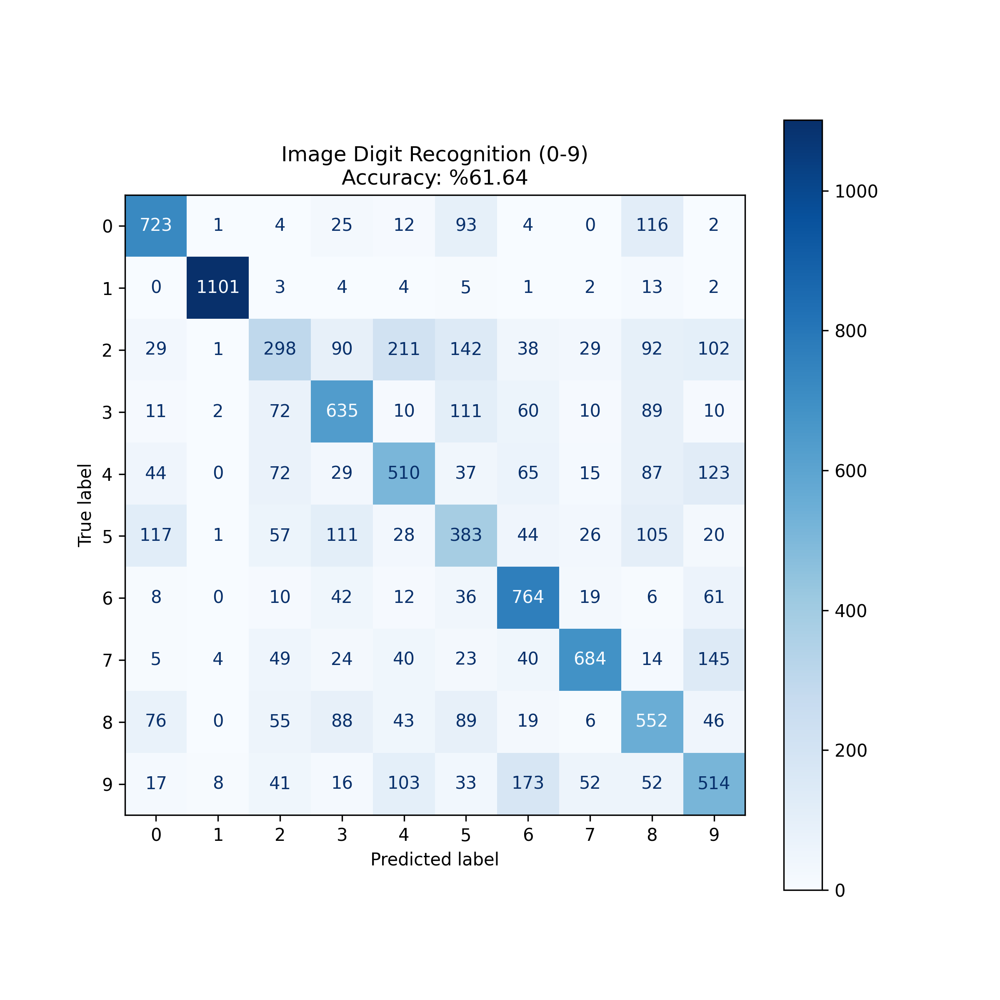

## Project Structure
The project covers two main applications:
1.  **Q1 (Section 12.8):** Keyword Spotting from Audio Signals.
2.  **Q2 (Section 12.9):** Handwritten Digit Recognition from Digital Images.

---

## Q1: Keyword Spotting (Audio)
**Goal:** Recognize spoken digits (0-9) and export the model for embedded implementation.
- **Dataset:** Free Spoken Digit Dataset (FSDD) (Automatically downloaded via script).
- **Preprocessing (Section 11.7 Logic):**
  - Sample Rate: 8000 Hz
  - Features: 13 MFCCs + 13 Delta MFCCs = **26 Features** per sample.
- **Model:** MLP (Dense Neural Network)
  - Architecture: Input(26) -> Dense(100, ReLU) -> Dense(100, ReLU) -> Output(10, Softmax).
- **Output:** `q1_audio_model_data.h` (C Header file containing the trained model).

---

## Q2: Digit Recognition (Image)
**Goal:** Recognize handwritten digits (MNIST) using Hu Moments and export the model.
- **Dataset:** MNIST (via TensorFlow/Keras API).
- **Preprocessing:**
  - Feature Extraction: **7 Hu Moments** per image.
  - Normalization: Z-score normalization.
- **Model:** MLP (Dense Neural Network)
  - Architecture: Input(7) -> Dense(100, ReLU) -> Dense(100, ReLU) -> Output(10, Softmax).
- **Output:** `q2_image_model_data.h` (C Header file containing the trained model).

---

## Deployment Workflow
The Python scripts perform the following "TinyML" workflow:
1.  **Training:** Train the model using TensorFlow/Keras.
2.  **Quantization/Conversion:** Convert the Keras model to **TensorFlow Lite (.tflite)** format.
3.  **Hex Dump:** Convert the binary `.tflite` file into a **C byte array** (`const unsigned char model[]`).
4.  **Integration:** The generated `.h` files are ready to be included in an STM32CubeIDE project.

**Generated Files:**
- `q1_audio_model_data.h`
- `q2_image_model_data.h`
